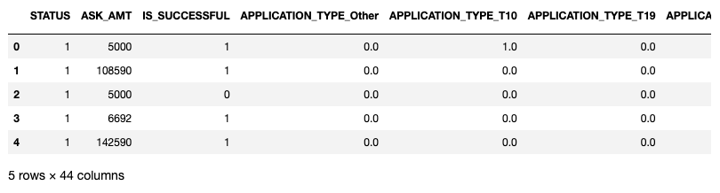
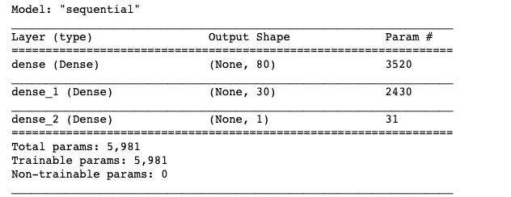
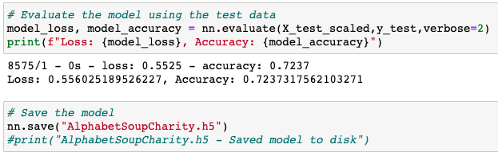
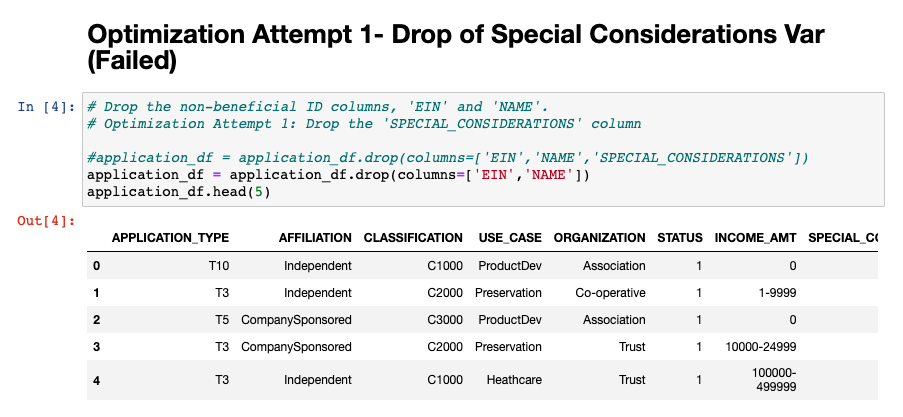
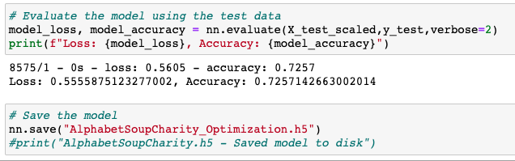

# Neural_Network_Charity_Analysis
Module 20 - Neural Networks and Deep Learning

## Deliverable 1: Preprocessing Data for a Neural Network Model

Performed Pre-processing for Neural Networks. The IS_SUCCESSFUL variable was identified as the target with the other variables being the features of the model. The categorical data was cleaned using the on-hot encoding tool to create the following dataframe. 

## Deliverable 2: Compile, Train, and Evaluate the Model

The data is then split into training and testing datasets. Next the neural network compounds the model using two hidden layers with 80 and 30 nodes respectivly. The model is then trained to saved the model's wieghts for 5 epochs. 

The table below is the cleaned datatable. 

The output below is the Model's accuracy after the initial Model attempt. The model's accuracy is 0.723. 

## Deliverable 3: Optimize the Model

###   Attempt 1 - Drop 'SPECIAL_CONSIDERATIONS' Variable [Failure]

Intially attempted to removed noisy variables such as SPECIAL_CONSIDERATIONS. After running the model it did not improve it's accuracy. 

###   Attempt 2 - Change of Binning for Application Types from less than 500 to less than 150. [Success] 

Second attempt at optimization was including more detailed data and groupings on application type to give the model more accuracy. The accuracy score improved slightly from 0.723 to 0.725.

###   Attempt 3 - Change of Binning for Classification from less than 1500 to less than 2000. [Failure] 

Attempted change of binning for Classification to include less binds and raise the constraint from less than 1500 to less than 2000. This would removed some of the bins, but did not make the model more accurate. 

###   Attempt 4

###   Attempt 5

## The report should contain the following:

1. Overview of the analysis: Explain the purpose of this analysis.

2. Results: Using bulleted lists and images to support your answers, address the following questions.
  - Data Preprocessing
      What variable(s) are considered the target(s) for your model?
      What variable(s) are considered to be the features for your model?
      What variable(s) are neither targets nor features, and should be removed from the input data?
  - Compiling, Training, and Evaluating the Model
      How many neurons, layers, and activation functions did you select for your neural network model, and why?
      Were you able to achieve the target model performance?
      What steps did you take to try and increase model performance?
      
3. Summary: Summarize the overall results of the deep learning model. Include a recommendation for how a different model could solve this classification problem, and explain your recommendation.
