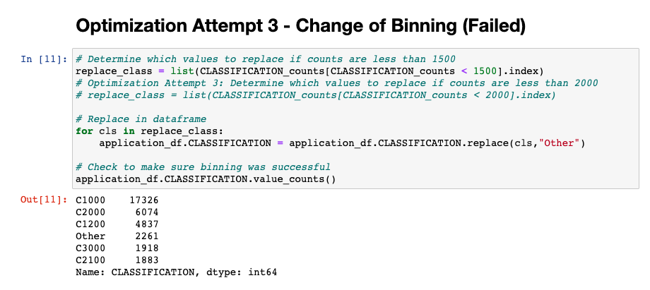

# Neural_Network_Charity_Analysis
Module 20 - Neural Networks and Deep Learning

## Purpose of Analysis:

The purpose of the analysis is the help Beks create a binary classifier to predict 'Successful' charity's that have been funded by Alphabet Soup. Using the feature variables of the previous applicants, we'll see if we are able to predict what fatures make up a 'Successful' candidate. 

## Deliverable 1: Preprocessing Data for a Neural Network Model

Performed Pre-processing for Neural Networks. The IS_SUCCESSFUL variable was identified as the target with the other variables being the features of the model. The EIN and NAME description variables were dropped. The categorical data was cleaned using the on-hot encoding tool to create the following dataframe. 

## Deliverable 2: Compile, Train, and Evaluate the Model

The data is then split into training and testing datasets. Next the neural network compounds the model using two hidden layers with 80 and 30 nodes respectivly. The model is then trained to saved the model's wieghts for 5 epochs. 

The table below is the cleaned datatable. 

The output below is the Model's accuracy after the initial Model attempt. The model's accuracy is 0.723. 

## Deliverable 3: Optimize the Model

###   Attempt 1 - Drop 'SPECIAL_CONSIDERATIONS' Variable [Failure]

Intially attempted to removed noisy variables such as SPECIAL_CONSIDERATIONS. After running the model it did not improve it's accuracy. 

###   Attempt 2 - Change of Binning for Application Types from less than 500 to less than 150. [Success] 

Second attempt at optimization was including more detailed data and groupings on application type to give the model more accuracy. The accuracy score improved slightly from 0.723 to 0.725.

###   Attempt 3 - Change of Binning for Classification from less than 1500 to less than 2000. [Failure] 

Attempted change of binning for Classification to include less binds and raise the constraint from less than 1500 to less than 2000. This would removed some of the bins, but did not make the model more accurate. 

###   Attempt 4 - Alternate Activation Functions. [Failure] 

Attempted to use alternative activations functions such as tanh. Reviewed and explored possible acitivation functions to use for the model but it did not improve it's accuracy. 

###   Attempt 5 - Change the number of epochs from 5 to 50. [Success] 

Changed the number of epochs used to train the model from 5 to 50. We can see the loss metric continuing to fall and the accuracy increasing with additional epochs. I selected the sigmoid function for it's output range of 0 to 1, as it seemed the best for the IS_SUCCESSFUL target.  The accuracy score improved slightly from 0.725 to 0.726.

      
## Summary: 

Overall, I was unable to reach the 0.75 accuracy rate in the classification model using a neaural network. However, through chnaging the binning and adding additional epochs I was able to improve the model's accuracy. I believe removing 'noisy' variable and adding additional layers could imporve the models accuracy. 
